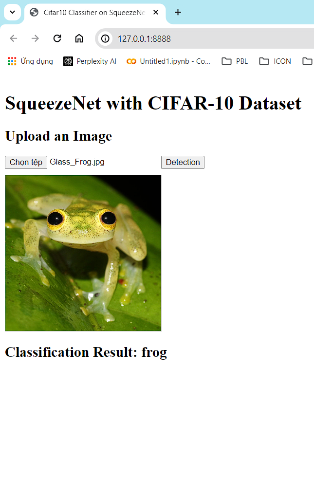

#Cài dặt các thư viện.(Install libraries)

pip install django

pip install pillow # Để xử lý hình ảnh

pip install tensorflow # Để load và chạy model .h5

pip install matplotlib # trực quan hoá loss,categorical_accuracy

Chạy file deploy_squeezenet.ipynb để build model và lưu file h5 và json của model (Run file deploy_squeezenet.ipynb to build and save weight and json of model)

#Khởi tạo django (không cần)
#django-admin startproject cifar10_squeezenet_classifier
#python manage.py startapp classifier

#Chạy server (Run server)
cd django_project_LMS\cifar10_squeezenet_classifier
python manage.py migrate
python manage.py runserver 8888

website: http://127.0.0.1:8888/

